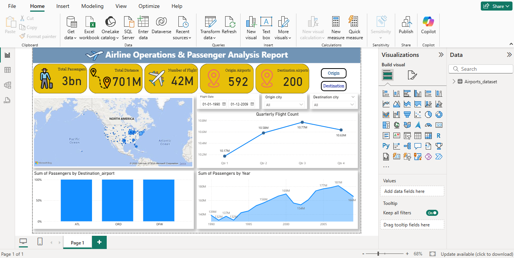

# ✈️ Airline Passenger & Flight Operations Dashboard

This project showcases an interactive Power BI dashboard built to analyze global airline operations and passenger trends from 1990 to 2009. The dataset includes over:

- 10 Billion Passengers
- 134 Million Flights
- 683 Origin Airports
- 708 Destination Airports

The purpose of this dashboard is to identify trends in passenger traffic, seasonal flight patterns, and airport-level activity using SQL for backend querying and Power BI for visualization.

---

## 📊 Key Features

- Passengers by Origin Airport: Compare traffic at top airports like ATL, ORD, DFW.
- Year-wise Passenger Volume: Visualize how air travel evolved across two decades.
- Quarterly Flight Trends: Observe seasonal fluctuations in flight activity.
- Filters for Deeper Analysis: Interactive slicers for origin, destination, and date range.

---

## 🛠️ Tools & Technologies
- Power BI Desktop
- SQL (for data querying and transformation)
- Microsoft Excel / CSV File Data

---

## 📸 Sample Dashboard Screenshot

---
